# 并行多Agent系统改造 - 设计文档

## 设计目标

1. **并行执行：** 将串行执行的多Agent讨论改为并行执行
2. **独立配置：** 为每个Agent提供独立的API密钥和rate limit
3. **异步通信：** 引入消息队列实现真正的异步通信
4. **水平扩展：** 支持动态创建和销毁Agent实例

## 模块划分

### 1. ParallelDiscussionManager（并行讨论管理器）

**职责：** 管理并行讨论流程，替代原有的串行DiscussionManager。

**核心设计：**
```python
class ParallelDiscussionManager:
    def __init__(self, agent_pool, message_queue, key_manager):
        self.agent_pool = agent_pool
        self.message_queue = message_queue
        self.key_manager = key_manager
    
    async def run_discussion(self, topic, max_rounds=3):
        """运行并行讨论"""
        for round in range(max_rounds):
            # 并行调用所有Agent
            tasks = [
                self._ask_agent(role, topic, round)
                for role in self.discussion_roles
            ]
            results = await asyncio.gather(*tasks, return_exceptions=True)
            
            # 处理结果
            for role, result in zip(self.discussion_roles, results):
                if isinstance(result, Exception):
                    logger.error(f"Agent {role} 执行失败: {result}")
                else:
                    await self._process_response(role, result)
    
    async def _ask_agent(self, role, topic, round):
        """向单个Agent提问"""
        agent = self.agent_pool.get_agent(role)
        prompt = self._build_prompt(role, topic, round)
        return await agent.reply(prompt)
```

**关键改进：**
- 使用 `asyncio.gather` 实现并行调用
- 支持超时控制和异常处理
- 集成AgentPool和KeyManager

### 2. KeyManager（密钥管理器）

**职责：** 管理各Agent的独立API密钥和rate limit。

**核心设计：**
```python
class KeyManager:
    def __init__(self):
        self.keys = {}  # role -> {api_key, base_url, rate_limit}
        self.usage = {}  # role -> {count, last_reset}
    
    def configure_key(self, role, api_key, base_url=None, rate_limit=None):
        """配置角色的API密钥"""
        self.keys[role] = {
            'api_key': api_key,
            'base_url': base_url,
            'rate_limit': rate_limit or 100  # 默认每分钟100次
        }
    
    def get_key(self, role):
        """获取角色的API密钥"""
        if role not in self.keys:
            raise ValueError(f"未配置角色 {role} 的API密钥")
        return self.keys[role]
    
    def check_rate_limit(self, role):
        """检查是否超出rate limit"""
        if role not in self.keys:
            return False
        
        config = self.keys[role]
        usage = self.usage.get(role, {'count': 0, 'last_reset': time.time()})
        
        # 每分钟重置计数
        if time.time() - usage['last_reset'] > 60:
            usage = {'count': 0, 'last_reset': time.time()}
            self.usage[role] = usage
        
        return usage['count'] < config['rate_limit']
    
    def record_usage(self, role):
        """记录API调用"""
        if role not in self.usage:
            self.usage[role] = {'count': 0, 'last_reset': time.time()}
        self.usage[role]['count'] += 1
```

**关键特性：**
- 支持按角色配置独立的API密钥
- 提供rate limit检查和记录
- 支持密钥轮换

### 3. MessageQueue（消息队列）

**职责：** 提供异步消息传递，支持持久化和重试。

**核心设计：**
```python
class MessageQueue:
    def __init__(self, db_path=None):
        self.queues = {}  # topic -> asyncio.Queue
        self.db_path = db_path
        self.retry_count = 3
        
        if db_path:
            self._init_db()
    
    async def publish(self, topic, message, priority=0):
        """发布消息到队列"""
        if topic not in self.queues:
            self.queues[topic] = asyncio.Queue()
        
        # 持久化消息
        if self.db_path:
            self._persist_message(topic, message, priority)
        
        await self.queues[topic].put((priority, message))
    
    async def subscribe(self, topic, handler):
        """订阅并处理消息"""
        if topic not in self.queues:
            self.queues[topic] = asyncio.Queue()
        
        while True:
            priority, message = await self.queues[topic].get()
            
            # 重试机制
            for attempt in range(self.retry_count):
                try:
                    await handler(message)
                    break
                except Exception as e:
                    if attempt == self.retry_count - 1:
                        logger.error(f"消息处理失败: {e}")
                        # 移入死信队列
                        await self._move_to_dlq(topic, message)
                    else:
                        await asyncio.sleep(2 ** attempt)  # 指数退避
    
    def _persist_message(self, topic, message, priority):
        """持久化消息到SQLite"""
        # SQLite持久化逻辑
        pass
    
    async def _move_to_dlq(self, topic, message):
        """移动消息到死信队列"""
        dlq_topic = f"{topic}.dlq"
        await self.publish(dlq_topic, message)
```

**关键特性：**
- 基于 `asyncio.Queue` 的内存队列
- 支持消息持久化到SQLite
- 提供重试机制和死信队列
- 支持消息优先级

### 4. AgentPool（Agent池管理器）

**职责：** 管理Agent实例的生命周期，支持动态扩展。

**核心设计：**
```python
class AgentPool:
    def __init__(self, key_manager, max_instances=10):
        self.key_manager = key_manager
        self.max_instances = max_instances
        self.agents = {}  # role -> [Agent]
        self.health_status = {}  # agent_id -> status
    
    def get_agent(self, role):
        """获取可用的Agent实例"""
        if role not in self.agents:
            self.agents[role] = []
        
        # 查找健康的Agent
        for agent in self.agents[role]:
            agent_id = id(agent)
            if self.health_status.get(agent_id, {}).get('healthy', True):
                return agent
        
        # 如果没有可用的Agent，创建新的
        if len(self.agents[role]) < self.max_instances:
            agent = self._create_agent(role)
            self.agents[role].append(agent)
            self.health_status[id(agent)] = {'healthy': True, 'last_check': time.time()}
            return agent
        
        raise RuntimeError(f"Agent池已满，无法创建更多 {role} 实例")
    
    def _create_agent(self, role):
        """创建新的Agent实例"""
        key_config = self.key_manager.get_key(role)
        # 创建Agent逻辑
        return Agent(
            name=role.value,
            system_prompt=AGENT_ROLE_PROMPTS[role],
            model=self._create_model(key_config)
        )
    
    async def health_check(self):
        """定期健康检查"""
        while True:
            for role, agents in self.agents.items():
                for agent in agents:
                    agent_id = id(agent)
                    try:
                        # 简单的健康检查：发送测试消息
                        await asyncio.wait_for(agent.reply("ping"), timeout=5)
                        self.health_status[agent_id] = {
                            'healthy': True,
                            'last_check': time.time()
                        }
                    except Exception as e:
                        self.health_status[agent_id] = {
                            'healthy': False,
                            'last_check': time.time(),
                            'error': str(e)
                        }
            
            await asyncio.sleep(60)  # 每分钟检查一次
    
    def scale_up(self, role, count=1):
        """扩容Agent实例"""
        for _ in range(count):
            if len(self.agents.get(role, [])) < self.max_instances:
                agent = self._create_agent(role)
                if role not in self.agents:
                    self.agents[role] = []
                self.agents[role].append(agent)
                self.health_status[id(agent)] = {'healthy': True, 'last_check': time.time()}
    
    def scale_down(self, role, count=1):
        """缩容Agent实例"""
        if role in self.agents:
            for _ in range(min(count, len(self.agents[role]))):
                agent = self.agents[role].pop()
                self.health_status.pop(id(agent), None)
```

**关键特性：**
- 支持动态创建和销毁Agent实例
- 提供健康检查和自动恢复
- 支持水平扩展（scale_up/scale_down）
- 集成KeyManager获取独立配置

## 失败处理策略

### 1. Agent执行失败

**处理方式：**
- 记录错误日志
- 返回默认响应或跳过该Agent
- 标记Agent为不健康状态
- 自动重试（可配置重试次数）

### 2. API调用超时

**处理方式：**
- 设置合理的超时时间（如30秒）
- 超时后取消当前任务
- 记录超时事件
- 可选：切换到备用API密钥

### 3. 消息队列故障

**处理方式：**
- 内存队列故障：降级为直接函数调用
- 持久化失败：记录警告，继续内存队列
- 消息丢失：通过重试机制恢复

### 4. 密钥无效或过期

**处理方式：**
- 检测API返回的认证错误
- 自动轮换到备用密钥（如果配置了）
- 记录密钥失效事件
- 通知管理员更新密钥

## 质量控制

### 1. 性能监控

**监控指标：**
- 讨论轮次时间
- Agent响应时间
- API调用成功率
- 消息队列积压数量

**监控方式：**
- 集成现有的trace模块
- 记录性能日志
- 提供性能报告接口

### 2. 并发控制

**控制策略：**
- 使用 `asyncio.Semaphore` 限制并发数
- 配置每个Agent的最大并发数
- 实现公平调度，避免某些Agent饥饿

### 3. 资源管理

**管理策略：**
- 限制Agent池大小
- 实现内存使用监控
- 提供资源清理机制

### 4. 测试策略

**测试类型：**
- 单元测试：测试各个模块的功能
- 集成测试：测试模块间的协作
- 性能测试：验证性能提升
- 压力测试：验证系统稳定性

## 架构图

```mermaid
graph TB
    subgraph "并行多Agent系统"
        A[MeetingCoordinator] --> B[ParallelDiscussionManager]
        B --> C[AgentPool]
        B --> D[MessageQueue]
        C --> E[KeyManager]
        
        subgraph "Agent实例"
            F[CEO Agent]
            G[PLANNER Agent]
            H[EXECUTOR Agent]
            I[MONITOR Agent]
            J[REVIEWER Agent]
        end
        
        C --> F
        C --> G
        C --> H
        C --> I
        C --> J
        
        subgraph "消息队列"
            K[内存队列]
            L[SQLite持久化]
            M[死信队列]
        end
        
        D --> K
        D --> L
        D --> M
    end
```



## 数据流

1. **讨论流程：**
   - MeetingCoordinator 发起讨论
   - ParallelDiscussionManager 并行调用所有Agent
   - 各Agent独立处理并返回结果
   - 结果汇总并更新讨论状态

2. **消息传递：**
   - Agent通过MessageQueue发送消息
   - 消息持久化到SQLite
   - 订阅者异步处理消息
   - 失败消息进入死信队列

3. **密钥管理：**
   - KeyManager提供独立的API密钥
   - Agent调用前检查rate limit
   - 调用后记录使用量
   - 支持密钥轮换

## 接口契约

### ParallelDiscussionManager

```python
class ParallelDiscussionManager:
    async def run_discussion(self, topic: str, max_rounds: int = 3) -> List[Dict]
    async def get_discussion_result(self) -> Dict
    async def cancel_discussion(self) -> None
```

### KeyManager

```python
class KeyManager:
    def configure_key(self, role: AgentRole, api_key: str, base_url: str = None, rate_limit: int = None) -> None
    def get_key(self, role: AgentRole) -> Dict
    def check_rate_limit(self, role: AgentRole) -> bool
    def record_usage(self, role: AgentRole) -> None
```

### MessageQueue

```python
class MessageQueue:
    async def publish(self, topic: str, message: Any, priority: int = 0) -> None
    async def subscribe(self, topic: str, handler: Callable) -> None
    async def get_queue_size(self, topic: str) -> int
```

### AgentPool

```python
class AgentPool:
    def get_agent(self, role: AgentRole) -> Agent
    async def health_check(self) -> None
    def scale_up(self, role: AgentRole, count: int = 1) -> None
    def scale_down(self, role: AgentRole, count: int = 1) -> None
    def get_pool_status(self) -> Dict
```
