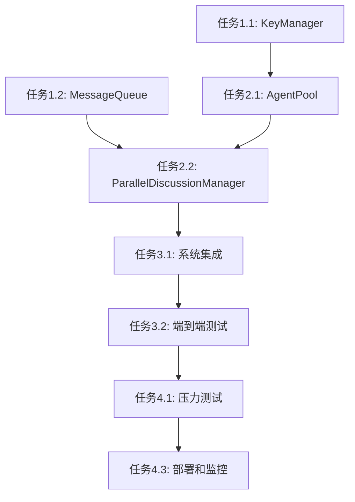

# 并行多Agent系统改造 - 任务文档

## 里程碑

### 里程碑 1：基础架构搭建（第1-2周）
- 完成核心模块设计
- 实现KeyManager和MessageQueue基础功能
- 搭建测试框架

### 里程碑 2：并行执行引擎（第3-4周）
- 实现ParallelDiscussionManager
- 集成AgentPool
- 完成性能测试

### 里程碑 3：系统集成（第5-6周）
- 集成所有模块
- 完成端到端测试
- 性能优化和调优

### 里程碑 4：生产就绪（第7-8周）
- 完成压力测试
- 文档完善
- 部署和监控

## 任务清单

### 阶段一：基础架构搭建

#### 任务 1.1：创建KeyManager模块
**优先级：** 高
**负责人：** 待定
**预计工时：** 3天

**子任务：**
1. 设计KeyManager类结构
2. 实现API密钥配置接口
3. 实现rate limit检查机制
4. 编写单元测试

**验收标准：**
- 能够为每个Agent角色配置独立的API密钥
- rate limit检查正常工作
- 单元测试覆盖率 > 90%

#### 任务 1.2：创建MessageQueue模块
**优先级：** 高
**负责人：** 待定
**预计工时：** 4天

**子任务：**
1. 设计MessageQueue类结构
2. 实现内存队列（基于asyncio.Queue）
3. 实现SQLite持久化
4. 实现重试机制和死信队列
5. 编写单元测试

**验收标准：**
- 消息发布和订阅正常工作
- 消息持久化到SQLite
- 重试机制正常工作
- 单元测试覆盖率 > 90%

#### 任务 1.3：搭建测试框架
**优先级：** 中
**负责人：** 待定
**预计工时：** 2天

**子任务：**
1. 配置pytest测试框架
2. 创建测试fixtures
3. 编写测试辅助函数
4. 配置CI/CD流水线

**验收标准：**
- 测试框架正常运行
- CI/CD流水线配置完成
- 测试覆盖率报告生成

### 阶段二：并行执行引擎

#### 任务 2.1：创建AgentPool模块
**优先级：** 高
**负责人：** 待定
**预计工时：** 4天

**子任务：**
1. 设计AgentPool类结构
2. 实现Agent实例创建和管理
3. 实现健康检查机制
4. 实现水平扩展接口
5. 编写单元测试

**验收标准：**
- 能够动态创建和销毁Agent实例
- 健康检查正常工作
- 水平扩展接口正常工作
- 单元测试覆盖率 > 90%

#### 任务 2.2：实现ParallelDiscussionManager
**优先级：** 高
**负责人：** 待定
**预计工时：** 5天

**子任务：**
1. 设计ParallelDiscussionManager类结构
2. 实现并行讨论逻辑（使用asyncio.gather）
3. 集成AgentPool和KeyManager
4. 实现超时控制和异常处理
5. 编写单元测试和集成测试

**验收标准：**
- 能够并行调用多个Agent
- 讨论轮次时间减少50%以上
- 异常处理正常工作
- 单元测试覆盖率 > 90%

#### 任务 2.3：性能测试和优化
**优先级：** 中
**负责人：** 待定
**预计工时：** 3天

**子任务：**
1. 设计性能测试场景
2. 实现性能测试脚本
3. 运行性能测试
4. 分析性能瓶颈
5. 优化代码

**验收标准：**
- 性能测试场景完整
- 性能测试结果符合预期
- 性能瓶颈得到优化

### 阶段三：系统集成

#### 任务 3.1：集成所有模块
**优先级：** 高
**负责人：** 待定
**预计工时：** 4天

**子任务：**
1. 修改MeetingCoordinator，使用ParallelDiscussionManager
2. 集成KeyManager配置
3. 集成MessageQueue通信
4. 实现向后兼容接口
5. 编写集成测试

**验收标准：**
- 所有模块正常协作
- 向后兼容接口正常工作
- 集成测试通过

#### 任务 3.2：端到端测试
**优先级：** 高
**负责人：** 待定
**预计工时：** 3天

**子任务：**
1. 设计端到端测试场景
2. 实现端到端测试脚本
3. 运行端到端测试
4. 修复发现的问题

**验收标准：**
- 端到端测试场景完整
- 所有测试用例通过
- 系统功能正常

#### 任务 3.3：性能优化和调优
**优先级：** 中
**负责人：** 待定
**预计工时：** 3天

**子任务：**
1. 分析系统性能瓶颈
2. 优化并发控制策略
3. 优化资源使用
4. 调整配置参数

**验收标准：**
- 性能瓶颈得到优化
- 并发控制策略合理
- 资源使用优化

### 阶段四：生产就绪

#### 任务 4.1：压力测试
**优先级：** 高
**负责人：** 待定
**预计工时：** 3天

**子任务：**
1. 设计压力测试场景
2. 实现压力测试脚本
3. 运行压力测试
4. 分析测试结果
5. 修复发现的问题

**验收标准：**
- 压力测试场景完整
- 系统在高负载下稳定运行
- 性能指标符合预期

#### 任务 4.2：文档完善
**优先级：** 中
**负责人：** 待定
**预计工时：** 2天

**子任务：**
1. 完善API文档
2. 编写用户手册
3. 编写部署文档
4. 编写运维文档

**验收标准：**
- API文档完整
- 用户手册清晰
- 部署文档详细
- 运维文档实用

#### 任务 4.3：部署和监控
**优先级：** 高
**负责人：** 待定
**预计工时：** 3天

**子任务：**
1. 配置部署环境
2. 实现部署脚本
3. 配置监控系统
4. 配置告警规则
5. 进行生产部署

**验收标准：**
- 部署环境配置完成
- 部署脚本正常工作
- 监控系统正常运行
- 告警规则配置完成

## 完成定义

### 代码完成
- 所有代码通过代码审查
- 单元测试覆盖率 > 90%
- 集成测试通过
- 端到端测试通过

### 测试完成
- 性能测试通过
- 压力测试通过
- 安全测试通过
- 兼容性测试通过

### 文档完成
- API文档完整
- 用户手册完整
- 部署文档完整
- 运维文档完整

### 部署完成
- 部署脚本测试通过
- 监控系统配置完成
- 告警规则配置完成
- 生产环境部署成功

## 依赖关系

## 风险和缓解措施

| 风险 | 影响 | 缓解措施 | 负责人 |
|------|------|----------|--------|
| 并行执行导致资源竞争 | 高 | 使用异步锁和队列控制并发度 | 待定 |
| API密钥管理复杂 | 中 | 提供统一的密钥管理接口 | 待定 |
| 消息队列故障 | 中 | 实现重试机制和降级策略 | 待定 |
| 性能不达标 | 高 | 进行性能测试和优化 | 待定 |
| 现有代码改造工作量大 | 中 | 采用渐进式迁移策略 | 待定 |

## 进度跟踪

### 周报模板
- 本周完成任务
- 下周计划任务
- 遇到的问题
- 风险和缓解措施

### 里程碑评审
- 里程碑完成情况
- 质量指标达成情况
- 风险和问题跟踪
- 下阶段计划调整
